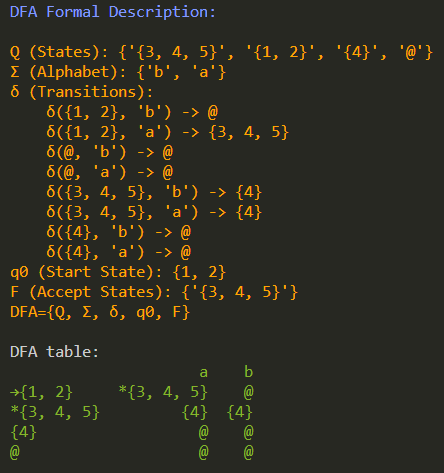

# Developer's Guide

## Installation

You can install the application by following the instructions:

1. Make sure Python is installed:

   - Windows: [Python Downloads](https://www.python.org/downloads/windows/)
   - Ubuntu: `sudo apt install python3`

2. Install Poetry: [Poetry Installation](https://python-poetry.org/docs/#installation)

   - Using pipx:
     ```
     pipx install poetry
     ```
   - Windows (PowerShell):
     ```
     (Invoke-WebRequest -Uri https://install.python-poetry.org -UseBasicParsing).Content | py -
     ```
   - Linux, macOS, WSL:
     ```
     curl -sSL https://install.python-poetry.org | python3 -
     ```

3. Add Poetry to environment variables (PATH):

   - Windows: `%APPDATA%\Python\Scripts`
   - Unix: `$HOME/.local/bin`

4. Install Graphviz: [Graphviz Download](https://graphviz.org/download/)

   - Windows: Download the installer
   - Ubuntu:
     ```
     sudo apt install graphviz
     ```

5. Make sure to add Graphviz to environment variables (PATH):

   - In Windows, check _`Add Graphviz to the system PATH for …`_ in the install options screen while installing it.
   - In Ubuntu, it should be added automatically after the installation.

6. _(Optional)_ On WSL and Ubuntu, if you encounter an error indicating that there is no module named Tkinter, use the following:

   ```
   sudo apt-get install python3-tk
   ```

7. In the root folder where the file _`pyproject.toml`_ exists, run the following command to install all the dependencies:
   ```
   poetry install
   ```

## Running the application

You can run the application using any of the following methods:

- **Method 1: Activating Poetry Virtual Environment:**

  ```
  poetry shell
  python main.py
  ```

- **Method 2: Running a command inside Poetry without activating the environment:**
  ```
  poetry run python main.py
  ```

# Project Documentation: NFA to DFA Conversion Tool

## 1. Relevance

This project demonstrates the practical application of theoretical concepts in automata theory, specifically NFA to DFA conversion, in a Python-based software system.

## 2. Abstract

The project presents a Python-based system for converting Non-deterministic Finite Automata (NFA) to Deterministic Finite Automata (DFA). It allows users to visualize the transformation process, enhancing understanding of automata theory.

## 3. Content

### Introduction

In the field of theoretical computer science, automata theory plays a crucial role in understanding computational processes. This project focuses on the conversion of NFAs to DFAs, a fundamental concept in automata theory. The project aims to provide an educational tool to visualize this conversion, making the theoretical aspects more accessible and understandable.

### Problem Specification

The project addresses the challenge of converting a Non-deterministic Finite Automaton (NFA) to its equivalent Deterministic Finite Automaton (DFA). NFAs and DFAs are abstract machines used in automata theory, but while NFAs allow multiple possible states from a given state and input, DFAs permit exactly one. The conversion process is non-trivial and understanding it is key to grasping the fundamentals of automata theory.

### Approach

The project is implemented in Python, leveraging the `visual_automata` library for visualization. The system allows users to input their NFA either manually or use a default NFA. The NFA is then automatically converted to its equivalent DFA, with both visualized using Graphviz. Key components include:

- `NFA.py` and `DFA.py`: Classes for NFA and DFA, with methods for conversion and visualization.
- `default_nfa.py`: Provides a default NFA for demonstration purposes.
- `utils.py`: Contains utility functions for user input and GUI display.
- `main.py`: The main script that integrates all modules and handles user interactions.

### Results and Analysis

The system successfully converts NFAs to DFAs, displaying both in a graphical format. The output includes a visualization of the NFA and DFA, as well as the DFA transition table printed in green.

**Outputs:**

- Original NFA (Input):  
   ---
   
   ---
- NFA and DFA Visualization (Output GUI):  
   ---
   
   ---
- DFA Transition Table (Output Table):  
   ---
   
   ---
### Conclusions

This project demonstrates the practical application of automata theory concepts. It has reinforced the understanding that while NFAs and DFAs are equivalent in terms of computational power, their structures can be significantly different. The visualization component effectively aids in comprehending the transformation process.

### References

- `visual_automata` library: Used for the visualization of NFAs and DFAs.
- Python documentation: For understanding Python-specific implementations.
- Automata Theory textbooks and online resources: To validate the theoretical concepts implemented in the project.
